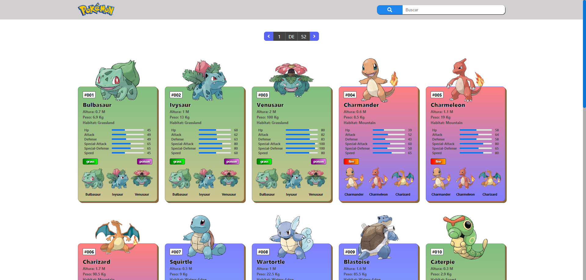

# PokeInfo-Dex



## Descripción

PokeInfo-Dex es una aplicación construida con Vite y React, utilizando SCSS para los estilos. Consume datos de la [PokeInfo API](https://pokemon-api-opal.vercel.app) para mostrar información sobre diferentes Pokémon. Está inspirada en el proyecto [Pokedex React](https://github.com/rolando-d3v/pokedex-react), del cual tomé ideas para la estructura y el diseño. Aunque la aplicación tiene similitudes, he agregado mis propias características y mejoras para hacerla única.

## Características

- **Lista de Pokémon:** Muestra una lista de Pokémon con información básica, como nombre y tipo.
- **Búsqueda de Pokémon:** Permite buscar Pokémon por nombre o Id.
- **Detalles del Pokémon:** Muestra detalles adicionales, como habilidades, estadísticas y evoluciones.
- **Estilos SCSS:** Utiliza SCSS para estilos flexibles y reutilizables.

## Configuración del Proyecto

Sigue estos pasos para configurar el proyecto en tu entorno local:

1. Clona el repositorio:

   ```bash
   git clone https://github.com/ljdr64/pokedex-react.git
   ```

2. Ve al directorio del proyecto:

   ```bash
   cd tu-repositorio
   ```

3. Instala las dependencias:

   ```bash
   npm install
   ```

4. Inicia el servidor de desarrollo:

   ```bash
   npm run dev
   ```

5. Abre tu navegador y ve a [http://localhost:5173](http://localhost:5173) para ver la aplicación en acción.

## Tecnología Utilizada

- **Vite:** Herramienta de desarrollo para aplicaciones web rápidas.
- **React:** Biblioteca para crear interfaces de usuario.
- **SCSS:** Preprocesador CSS para estilos personalizados.
- **PokeInfo API:** API desarrollada para proporcionar datos sobre Pokémon.

## Contribución

Si deseas contribuir a este proyecto, puedes abrir un issue o enviar un pull request. Estaré encantado de recibir tus sugerencias y mejoras.

## Licencia

Este proyecto está licenciado bajo la [MIT License](LICENSE). Consulta el archivo de licencia para más detalles.

## Contacto

Para preguntas o comentarios sobre PokeInfo-Dex, puedes contactarme a través de [GitHub](https://github.com/ljdr64).
